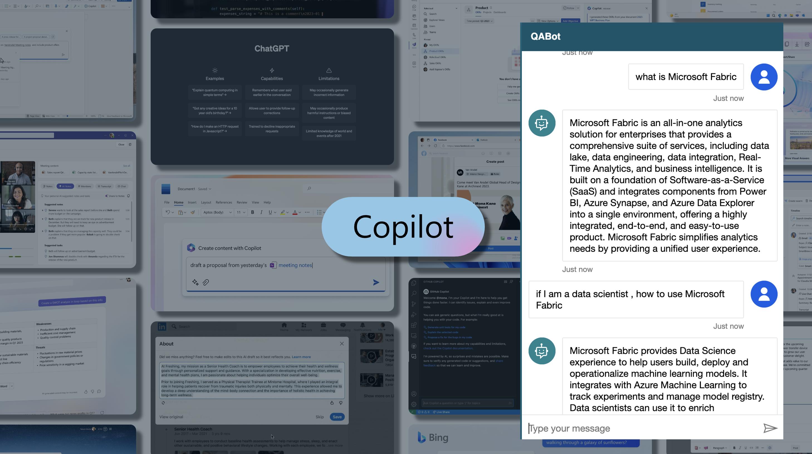
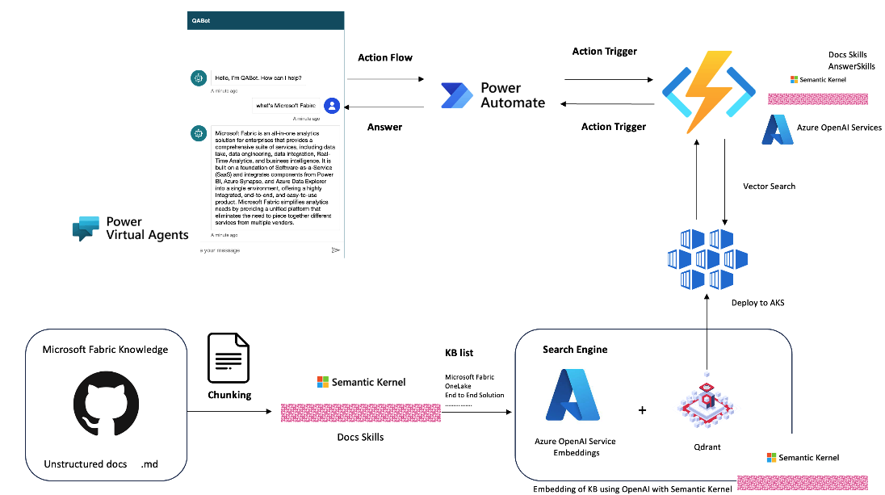

# **🫵 Building Microsoft Fabric Copilot App Workshop**

## **📡 What is Microsoft Fabric ?**

Microsoft Fabric is an all-in-one analytics solution for enterprises that covers everything from data movement to data science, Real-Time Analytics, and business intelligence. It offers a comprehensive suite of services, including data lake, data engineering, and data integration, all in one place.

With Fabric, you don't need to piece together different services from multiple vendors. Instead, you can enjoy a highly integrated, end-to-end, and easy-to-use product that is designed to simplify your analytics needs.

The platform is built on a foundation of Software as a Service (SaaS), which takes simplicity and integration to a whole new level.

## **🔥 Create Microsoft Fabric Copilot Apps for Beginners**

The Copilot app can be used as an auxiliary tool in your daily work to solve different problems. Microsoft Fabric is a brand new product, and people from all walks of life want to know about it. In the process of communicating with Copilot, the public can understand the applicable scenarios, basic terms, and related examples of Microsoft Fabric.

## **🔥 How to create**

This is a lot of interesting points, let’s explain it in a few steps

1. Microsoft Fabric is a brand new product, and Microsoft has released rich content in Microsoft Docs and Microsoft Learn. However, the model data of Azure OpenAI Service is limited data, and there is no Microsoft Fabric with new knowledge points. We added new knowledge points to the gpt-35-turbo model in the form of vector Embeddings through the text-embedding-ada-002 model on Azure OpenAI Service combined with the Microsoft Learn markdown file in GitHub.

2. Microsoft Fabric has a lot of terms, we know that it involves a lot of documents and knowledge, we need to choose a vector database for related storage. Here I choose Qdrant because it is a relatively low-cost entry-level technology solution that can be deployed directly on the cloud and locally through containers.

3. Or you will pay attention to the Prompt in the project, which uses the Prompt to extract knowledge and organize answers based on questions. There will be detailed answers in the first stage of the Workshop

4. Semantic Kernel is an open source framework for LLM, supporting Python, .NET, Java, Typescript and other technologies. Allow developers or Prompt engineers to better implement large model projects

5. Deploy Qdrant's database through AKS and API support through Azure Function as a backend service.

6. The realization of Chat is completed by using Power Virtual Agent . In Power Virtual Agent, we call the API of Azure Function through Power Automate to complete QA

This is the architecture

## **🔥 About Workshop**

The Workshop has 3 labs

**🧪 Lab 0 - Setting your GitHub Codespaces** 

Before starting to the labs, we must complete the relevant development environment configuration. GitHub Codespaces is your best partner. Through GitHub Codespaces, we can access it across devices and under any browser. It is easier for us to complete open source project maintenance and learning. Through the study of Lab 0, you will learn how to build a Copilot application development environment based on GitHub Codespaces.

⏰ <u>Hour :</u> 40 min - 60 min

🔗 <u>Link :</u> Click [this link](./labs/lab0/README.md)

**🧪 Lab 1 - Prototype** 

**🧪 Lab 2 - Deploy to Cloud**

**🧪 Lab 3 - Using Power Virtual Agent**

## **🔥 Prerequirement**

1. **.NET 7+** https://dotnet.microsoft.com/en-us/
   
2. **Azure** 

You can get Microsoft Azure free https://azure.com/free 

If you are a student https://aka.ms/studentgetazure 

3. **Microsoft 365**

You can get trial https://learn.microsoft.com/en-us/power-virtual-agents/sign-up-individual

4. **GitHub Codespaces**

https://github.com/features/codespaces

## **🔥 Resources**

1. Learn more about Azure OpenAI Service https://learn.microsoft.com/en-us/azure/cognitive-services/openai/overview

2. Learn more about Azure Kubernetes Service https://learn.microsoft.com/en-us/azure/aks/intro-kubernetes

3. Learn more about Azure Function Service https://learn.microsoft.com/en-us/azure/azure-functions/functions-overview?pivots=programming-language-csharp

4. Learn more about Semantic Kernel https://learn.microsoft.com/en-us/semantic-kernel/overview/

5. Learn more about Power Virtual Agent https://learn.microsoft.com/en-us/power-virtual-agents/fundamentals-what-is-power-virtual-agents

6. Learn more about Qdrant https://qdrant.tech/documentation/

