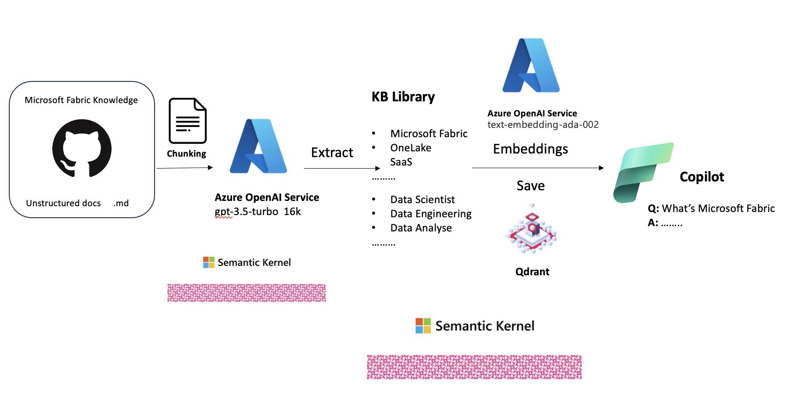

# **🧪  实验一 - 构建你的 Copilot 应用原型**

## **📚 应用介绍**

随着新人工智能时代的到来，多模态模型具有类人思维。 通过这些多模态模型可以生成及时的指导来构建不同的内容。 Microsoft Build 2023 微软提出了基于Azure OpenAI Service的 Copilot 应用程序技术堆栈，让个人和企业可以轻松构建交互式垂直 Copilot 应用程序。


我们希望Azure OpenAI Service的多模态模型拥有更多的知识，比如企业中的数据、新知识、时效性新闻。 不幸的是，我们的模型训练基于恒定时间知识。 我们需要在模型中加入自己的数据或者新的知识，一般是通过知识嵌入来完成的。

在实验一中，我们将基于 Azure OpenAI Service 提取 Microsoft Fabric 的知识点，并完成一个基本原型，希望能给您带来一些启发。 😏


## **🍔  为什么选择 Semantic Kernel**

为了完成 Copilot 应用程序，我们需要一些框架。 目前市场上流行的框架有 LangChain 和 Semantic Kernel。

### **🧰 LangChain**

[LangChain](https://github.com/hwchase17/langchain) 是一个用于开发由大语言模型支持的应用程序的框架。 它支持以下应用程序：

*数据感知：*将语言模型连接到其他数据源

*代理：*允许语言模型与环境交互

LangChain 的主要价值道具有：

1. 组件：用于处理语言模型的抽象，以及每个抽象的实现集合。 无论您是否使用 LangChain 框架的其余部分，组件都是模块化且易于使用的

2. 现成 chains ：用于完成特定更高级别任务的组件的结构化组装

现成的 chains 让您可以轻松上手。 对于更复杂场景，组件页可以轻松定制现有 chains 或构建新 chains。

### **🧰 Semantic Kernel**

[Semantic Kernel](https://github.com/microsoft/semantic-kernel) 是一个开源 SDK，可让您轻松地将 OpenAI、Azure OpenAI 和 Hugging Face 等 AI 服务与 C# 和 Python 等传统编程语言结合起来。 通过这样做，您可以创建结合两全其美的人工智能应用程序。

Semantic Kernel 的设计使开发人员能够灵活地将人工智能服务集成到他们现有的应用程序中。 为此，语义内核提供了一组连接器，可以轻松添加内存和模型。 通过这种方式，Semantic Kernel 能够为您的应用程序添加一个模拟的“大脑”。

### **LangChain 🆚 Semantic Kernel**

LangChain 和 Semantic Kernel 都是开源项目。 LangChain 的开发时间相对较长，支持的库和应用场景也比 Semantic Kernel 更多。 不过，Semantic Kernel 支持的编程语言比 LangChain 支持的 Python、JS ，还支持 Java、C# 等，而且相比 LangChain，它在提示和编程语言的结合上更好。 更好地支持将 Azure OpenAI 服务添加到旧项目。 Semantic Kernel对于非机器学习工程师更加友好，开发团队更容易过渡到面向AI的编程。


*注意:*  <u>本次实验基于 Semantic Kernel 0.17.230704.3-preview 和 .NET 7+</u>


## **🚪 基本概念**


### **获取 Microsoft Fabric 文件**

我们想让 Copilot 应用程序学习我们对 Microsoft Fabric 的知识，首先我们需要有Microsoft Fabric的文档。 我们可以通过 Microsoft Learn 对应的GitHub Repo获取所有原始 markdown 文件


**🗄️ 获取你的数据**

打开终端 , 创建 code 文件夹 , 在该文件夹下 clone Microsoft Fabric Repo 

```bash

mkdir code && cd code

git clone https://github.com/MicrosoftDocs/fabric-docs.git

```

1. 在 code 文件夹 , 使用 GitHub Codespaces 使用 prototype.ipynb file , 并选择 Kernel 为 '.NET Interactive'


*注意:*  如果你没有配置 GitHub Codespaces 请回到 [实验准备](../lab0/README.md)


**🔍 了解你的数据**

在进行原型设计之前，我们需要了解我们下载的非结构化数据，这对我们的工作非常有利。

我们希望关于 Microsoft Fabric 的每一个知识点都可以通过 Azure OpenAI Service 上的模型来掌握。 但如何处理非结构化内容是关键。 我们在下载的 Markdown 中发现了一些模式。 比如文件头中有描述的文件（作者、时间、摘要等），知识点则用markdown格式的#、##、###表示，或者我们可以这样写 prompt 让 Azure OpenAI 服务中的大型模型帮助我们提取相关细节


这时候我们可以很方便的定义一些数据规则，或者我们需要一个 JSON 来保存这些提取的知识点，比如：

[{"kb":"What is Microsoft Fabric?","content":"......."},{"kb":"....","content":"..."}]


**🤖 使用 Azure OpenAI Service**

Azure OpenAI Service集成了不同的OpenAI大模型，现在GA有GPT-3、ChatGPT、Codex、DALL-E，与Azure的企业功能集成。 让企业在使用大模型型的过程中更加安全可靠


如果想要使用Azure OpenAI Service，除了需要Azure账户外，还需要申请。 本实验需要gpt-35-turbo-16k和text-embedding-ada-002，所以只需点击 [该链接](https://customervoice.microsoft.com/Pages/ResponsePage.aspx?id=v4j5cvGGr0GRqy180BHbR7en2Ais5pxKtso_Pz4b1_xUOFA5Qk1UWDRBMjg0WFhPMkIzTzhKQ1dWNyQlQCN0PWcu) 去申请 (大概 1-2 个工作台就可以用过 🤗🤗🤗), 至于 GPT-4 , 现在排队的还是很多就不太建议了 😥😥😥😥.

如果您想了解如何在 Azure OpenAI 服务上使用该模型，请使用该 [连接](https://learn.microsoft.com/en-us/azure/cognitive-services/openai/how-to/create-resource?pivots=web-portal)


**💬  Prompt 工程**

在这一步之前，我们已经完成了关于 Microsoft Fabric 的下载和数据关系。 这时候我们就需要写一些提示来提取数据。 那么我们如何进行 Prompt 项目呢？ Azure AI Studio 的 Playground 可以提供帮助。 但这里我介绍使用 Semantic Kernel 的 Visual Studio Code 插件。 比较适合我们完成 Prompt 项目的测试


1.在 code 文件夹内创建 skills 文件夹

2.在 skills 中创建 ReadSkill 文件夹

3.在 ReadSkill 中创建KB文件夹

在 Semantic Kernel 中，不同的 Prompt 被称为 Skills，我们可以通过调用不同的[Skills](https://github.com/microsoft/semantic-kernel/blob/main/docs/SKILLS.md)来调用 Prompt 的操作。 技能是指作为单个功能或与该技能相关的一组功能可供 Kernel 使用的专业领域。 SK 技能的设计优先考虑了开发人员的最大灵活性，既轻量又可扩展。


每个技能的提示和参数设置都放在每个具体技能的文件夹中。 提示对应的文件为skprompt.txt，参数设置的文件为config.json。


让 Prompt 提取 markdown 的内容，这其实和人的思维是一样的。 根据上面的内容和理解，我们得到如下的Prompt（skprompt.txt）

```txt

Extract the input according to the following conditions, keep the knowledge points, summarize the detailed content of the knowledge points and delete the content related to the picture before outputting, please keep the content related to the link when outputting

Starting with # , ## , ### is a knowledge point

1.

[INPUT]
# ABC
...............

## CDF 
..........
### GGG
.....
[END INPUT]

[OUTPUT]
[{"KB": "ABC", "Content":"..............."},{"KB": "CDF", "Content":".........."},{"KB": "GGG", "Content":"....."}]
[END OUTPUT]

2.

[INPUT]
# ABC
...............

### GGG
.....

[END INPUT]

[OUTPUT]
[{"KB": "ABC", "Content":"..............."},{"KB": "GGG", "Content":"....."}]
[END OUTPUT]


[INPUT]
{{$input}}
[END INPUT]

```

相关参数设置 (config.json)


```json

{
    "schema": 1,
    "type": "completion",
    "description": "Get KB Content",
    "completion": {
      "max_tokens": 13000,
      "temperature": 0.0
    }
}

```

4.选择 Semantic Kernel 的插件，并登录对应的 Azure 账户


选择订阅对应的Azure OpenAI Endpoint，以及要测试的模型和方法


点击运行，会弹出输入框


输入以下的内容

```txt

# What is Microsoft Fabric?

Microsoft Fabric is an all-in-one analytics solution for enterprises that covers everything from data movement to data science, Real-Time Analytics, and business intelligence. It offers a comprehensive suite of services, including data lake, data engineering, and data integration, all in one place.

```

我们可以看到命令行会出现，如下图


*注意:*  

1. Semantic Kernel 插件目前仍处于预览阶段，因此使用时会出现不同的问题，请谨慎使用

2. Semantic Kernel 插件依赖.NET 6，请直接在命令行运行


```bash

sudo apt-get install -y dotnet-sdk-6.0

```


**🧠 Embeddings**


嵌入是一种特殊的数据表示格式，可以轻松地被机器学习模型和算法使用。 嵌入是一段文本语义的信息密集表示。 每个嵌入都是一个浮点数向量，使得向量空间中两个嵌入之间的距离与原始格式中两个输入之间的语义相似性相关。 例如，如果两个文本相似，那么它们的向量表示也应该相似。 要了解有关嵌入的更多信息，请访问此[链接](https://learn.microsoft.com/en-us/azure/cognitive-services/openai/how-to/embeddings?tabs=console)

市面上有很多矢量数据库可以辅助我们进行嵌入式工作。 这里我选择了[Qdrant](https://qdrant.tech/)，但是你也可以选择不同的向量数据库方案，比如Pinecone

***在 GitHub Codespaces安装和运行 Qdrant ***


```bash

docker pull qdrant/qdrant

docker run -p 6333:6333 qdrant/qdrant

```


## **🎬 一起开启**



点击 [笔记本](../../../code/lab1/prototype.ipynb)  进行学习


## **🔁 继续学习**

原型搭建成功后，你会发现教授 AI 专业知识是一件非常简单的事情。 恭喜您成为 AI 导师！


## **🪵 相关资源**

1. 学习 [Azure OpenAI Service](https://learn.microsoft.com/en-us/azure/cognitive-services/openai/overview)

2. 学习 [Semantic Kernel](https://learn.microsoft.com/en-us/semantic-kernel/overview/)

3. 学习 [Qdrant](https://qdrant.tech/documentation/)

   


