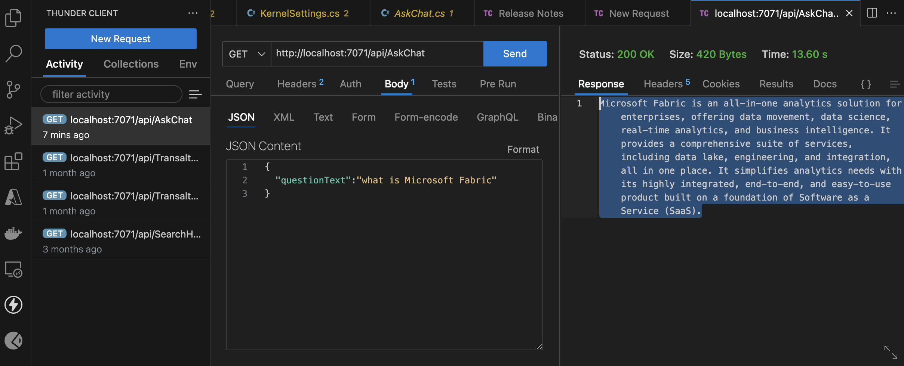
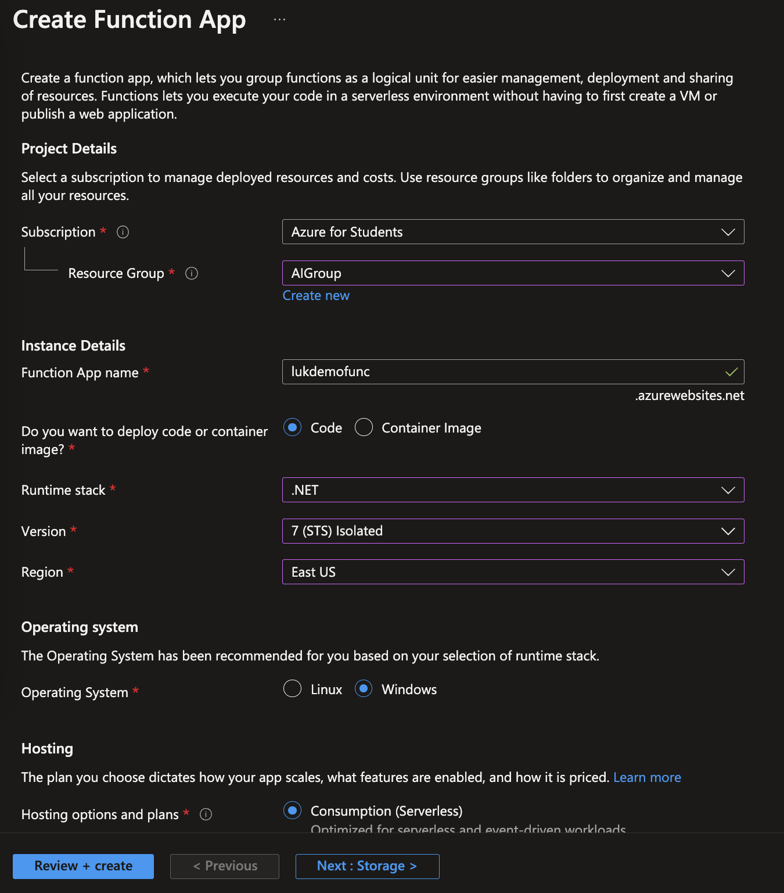
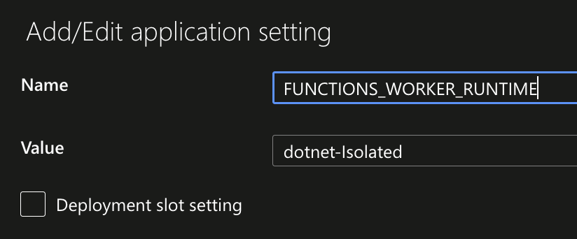
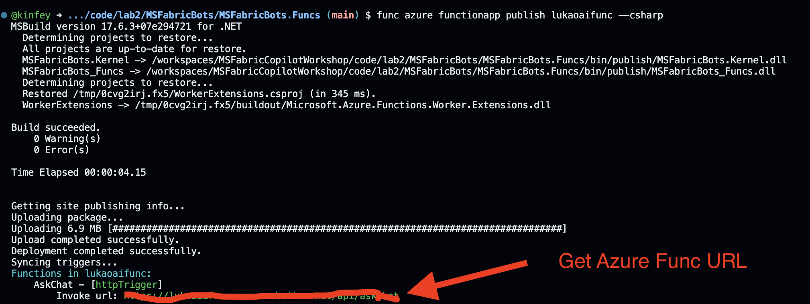
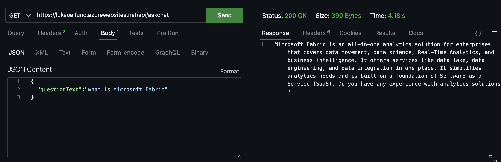

# **🧪  实验二 - 部署到云端**

我们在实验室一中使用 Semantic Kernel 和 Qdrant 创建了 Microsoft Fabric Copilot 原型。 这时候我们就需要实现 Copilot 应用程序的开发。 我们需要结合云应用来实现。 毫无疑问，Microsoft Azure 将成为实验二的重点。

## **☁️ 入坑云原生**

云原生应用程序是从头开始构建的，针对云规模和性能进行了优化。 它们基于微服务架构，使用托管服务，并利用持续交付来实现可靠性和更快的上市时间。

在Copilot应用程序中，我们可以与云原生应用程序完全集成。 在实验室一中，Qdrant 以容器的形式在本地使用，我们可以将其与Azure Kubernetes Service结合部署。 对于与知识库的交互，我们还可以通过 Azure Function 将其发布为 Serverless API。


## **🛠️ 部署 Qdrant 到 Azure Kubernetes Service**

### **🌪️ 什么是 Azure Kubernetes Service**

Azure Kubernetes 服务 (AKS) 通过将运营开销转化到 Azure上，大大简化了在 Azure 中部署托管 Kubernetes 群集的过程。 作为托管 Kubernetes 服务，Azure 处理关键任务，例如运行状况监控和维护。 创建 AKS 群集时，会自动创建并配置控制平面。 


### **🌪️ 部署方法**

***准备工作***

1. 安装 Azure CLI [https://learn.microsoft.com/en-us/cli/azure/install-azure-cli](https://learn.microsoft.com/en-us/cli/azure/install-azure-cli)

2. 安装 Heml [https://helm.sh/docs/intro/install/](https://helm.sh/docs/intro/install/)

3. 申请 [Azure](https://azure.com/free)  或 [Azure For Student](https://aka.ms/studentgetazure)


***🏃‍♂️  Let's Go***

1. Clone GitHub Repo  git clone https://github.com/Azure-Samples/qdrant-azure.git

2. 在终端中输入

```bash
   
   az login

   az account set --subscription "Your Subscription"

   az group create --name "Azure Resource Group" --location "Azure Region"

   az sshkey create --name "qdrantSSHKey" --resource-group "AIGroup"

```

3. 点击进入 [AKS](https://portal.azure.com/#create/Microsoft.Template/uri/https%3A%2F%2Fraw.githubusercontent.com%2FAzure-Samples%2Fqdrant-azure%2Fmain%2FAzure-Kubernetes-Svc%2Faks-arm-deploy.json)

4. 根据下图完成设置


5. 在命令行中输入


```bash

kubectl get nodes

cd YourQdrantOnAzureFolder/Azure-Kubernetes-Svc

helm install azqdrant-sk ./qdrant-on-azure --create-namespace

```

6. 在终端检查 Qdrant 是否部署成功


```bash

kubectl get services

```


1. 红色部分就是我们 Qdrant 在 Azure 上的公共 IP 地址。 恭喜，您已成功在云中的 Azure 上部署 Qdrant。 修改连接到实验一 Notebook Kernel 的 Qdrant 地址后，可以重新运行 Notebook


```csharp

IKernel kernel = Kernel.Builder
            .WithAzureChatCompletionService("Your Deplpyment model name", "Azure OpenAI Endpoint", "Azure OpenAI Key")
            .WithAzureTextEmbeddingGenerationService("Your Deplpyment model name", "Azure OpenAI Endpoint", "Azure OpenAI Key")
            .WithQdrantMemoryStore("http://YourQdrantonAzureIP:6333", 1536)
            .Build();

```


## **🛠️ Azure Function**

Azure Functions 是一种 Serverless 解决方案，可让你编写更少的代码、维护更少的基础设施并节省成本。 云基础设施提供了保持应用程序运行所需的所有最新资源，而不必担心部署和维护服务器。

如上架构图所示，我们使用 Serverless 作为 Copilot 的交互API

***🏃‍♂️ Let‘s go***

1. 进入 ./code/lab2/MSFabricBots

2. 在你的 Codespaces 修改 MSFabricBots.Funcs/appsettings.json 

```json

{
    "AzureOpenAI": {
      "deployName": "Your GPT-3 ModelName",
      "endpoint": "Your Azure Endpoint",
      "apiKey": "Your Azure OpenAI Key",
      "embeddingDeployName": "Your Embedding Endpoint",
      "vectorDBEndpoint": "http://YourAKSEndPoint:6333",
      "memoryCollectionName":"fbkb-concept"
    }
}

```

3. 打开终端


```bash

cd ./code/lab2/MSFabricBots/MSFabricBots.Funcs

func host start

```

4. 打开你的 GitHub Codepsaces Thunder Client 插件




5. 在 Azure Portal 创建 Function App




6. 进入你的 Azure Function ， 确认你的配置




7. 在你的 GitHub Codespaces 中打开终端


```bash

cd ./code/lab2/MSFabricBots/MSFabricBots.Funcs

func azure functionapp publish lukaoaifunc --csharp


```



8. 在你的 GitHub Codespaces Thunder Client 插件中检查





## **🔁 继续学习**

我们通过云原生技术创建了向量数据库和 API。 恭喜你已经通过实验二完成了基于 Copilot 后端的操作。在我们的实验三中，将会说说前端设置


## **🪵 相关资源**

1. 学习 [Azure Function Service](https://learn.microsoft.com/en-us/azure/azure-functions/)

2. 学习 [Azure Kubernetes Service](https://learn.microsoft.com/en-us/azure/aks/)


 


