# **🧪 Lab 0 - Setting your GitHub Codespaces**

Before start our labs, we need to configure the environment with GitHub Codespaces

## **🧰 GitHub Codespaces**

A codespace is a development environment that's hosted in the cloud. You can customize your project for GitHub Codespaces by committing configuration files to your repository (often known as Configuration-as-Code), which creates a repeatable codespace configuration for all users of your project.

Each codespace you create is hosted by GitHub in a Docker container, running on a virtual machine. You can choose from a selection of virtual machine types, from 2 cores, 8 GB RAM, and 32 GB storage, up to 32 cores, 64 GB RAM, and 128 GB storage.

### **Start Your Codespaces**


1. Sign in your [GitHub Portal](https://github.com/)

   **Note:** If you have no GitHub account , please [Sign up](https://github.com/signup)


2. Click on your Profile photo in the upper right corner of the portal, and select ‘Your codespaces’ from the expanded menu


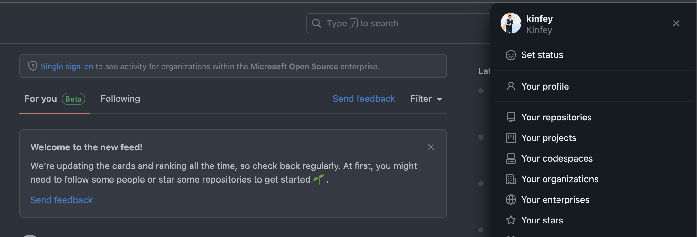

3. Choose Blank template


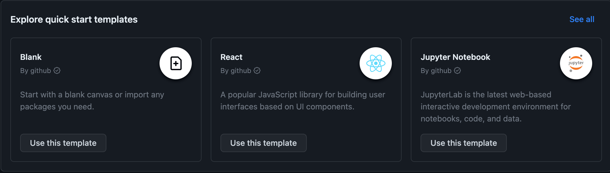

4. Using 'Ctrl+Shift+P' ( Windows / Linux ) or 'Cmd+Shift+P' ( macOS) to choose ' Codespaces : Add Dev Containers Cogiguration Files ...'


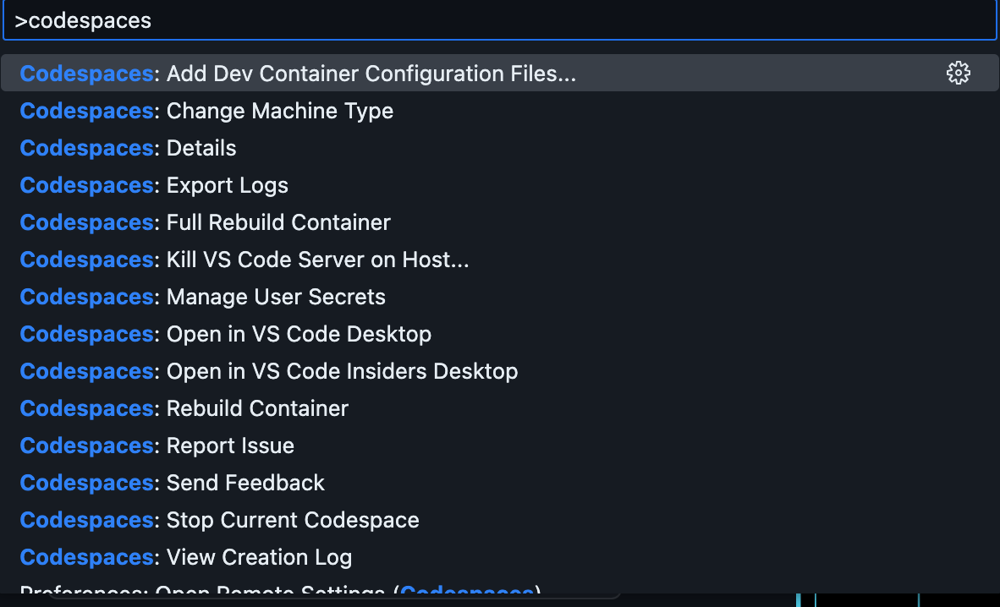

   Then choose 'Create a new configuration'

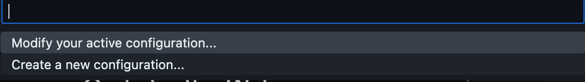

5. Set C# (.NET) devcontainers
   
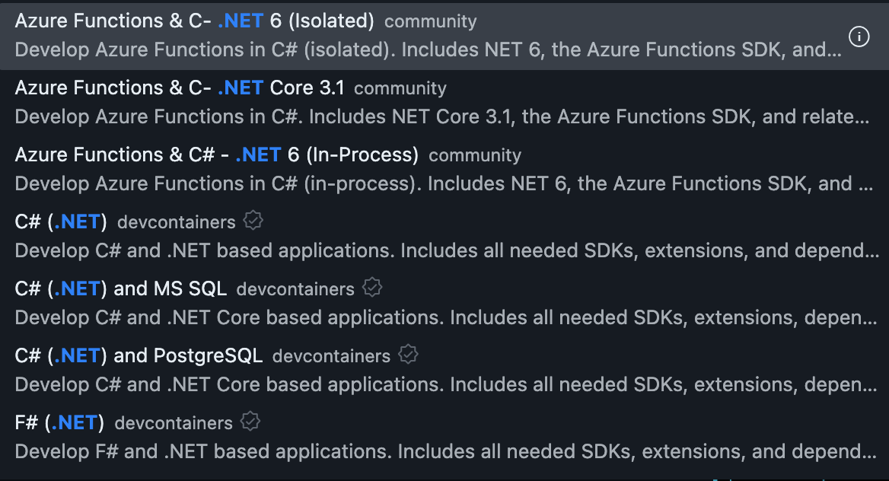

   Chooese 7.0 
   
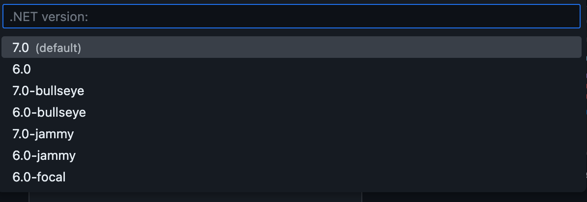


6. Choose Azure CLI , Azure Functions Core Tools , Docker in your dev containers , then Choose OK and 'Keep defaults' to finish

7. Add Extensions in your devcontainer.json

**.NET Extension Pack**

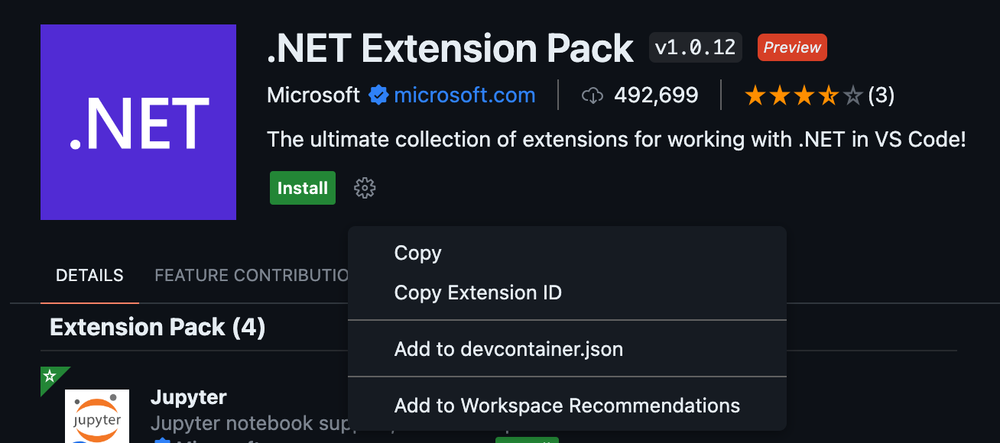

**Azure Tools**

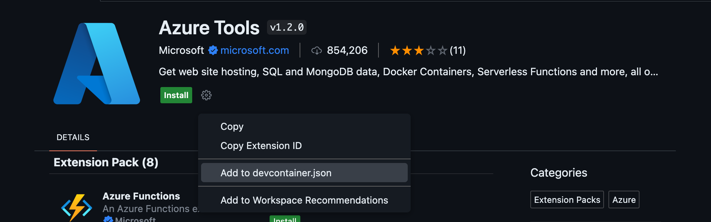

**Azure Functions**

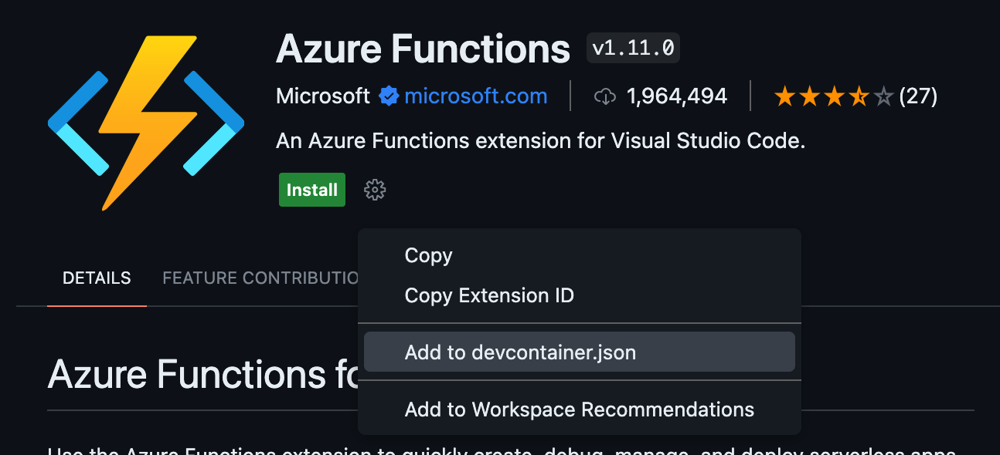

**Docker**

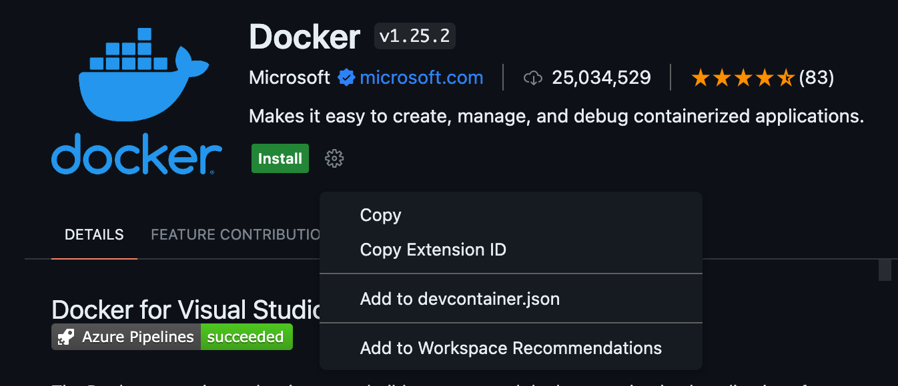

**Thunder Client**

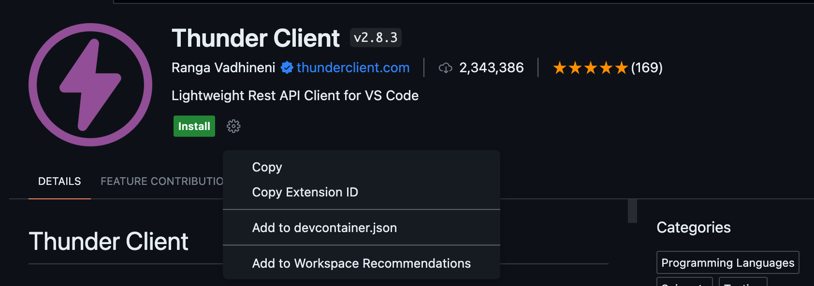

**Polyglot Notebooks**


*Note:*  Please check your devcontainer.json 

```json

{
	"name": "C# (.NET)",
	// Or use a Dockerfile or Docker Compose file. More info: https://containers.dev/guide/dockerfile
	"image": "mcr.microsoft.com/devcontainers/dotnet:0-7.0",
	"features": {
		"ghcr.io/devcontainers/features/azure-cli:1": {},
		"ghcr.io/devcontainers/features/docker-in-docker:2": {},
		"ghcr.io/jlaundry/devcontainer-features/azure-functions-core-tools:1": {}
	},
	"customizations": {
		"vscode": {
			"extensions": [
				"ms-vscode.vscode-node-azure-pack",
				"ms-dotnettools.vscode-dotnet-runtime",
				"ms-azuretools.vscode-docker",
				"rangav.vscode-thunder-client",
				"ms-azuretools.vscode-azurefunctions",
				"ms-dotnettools.dotnet-interactive-vscode"
			]
		}
	}
}


```

8. Choose Rebuild your codespaces dev container
   


9. After Rebuild ,using 'Ctrl+Shift+P' ( Windows / Linux ) or 'Cmd+Shift+P' ( macOS) to choose ' Codespaces : Change Machine Type'
   
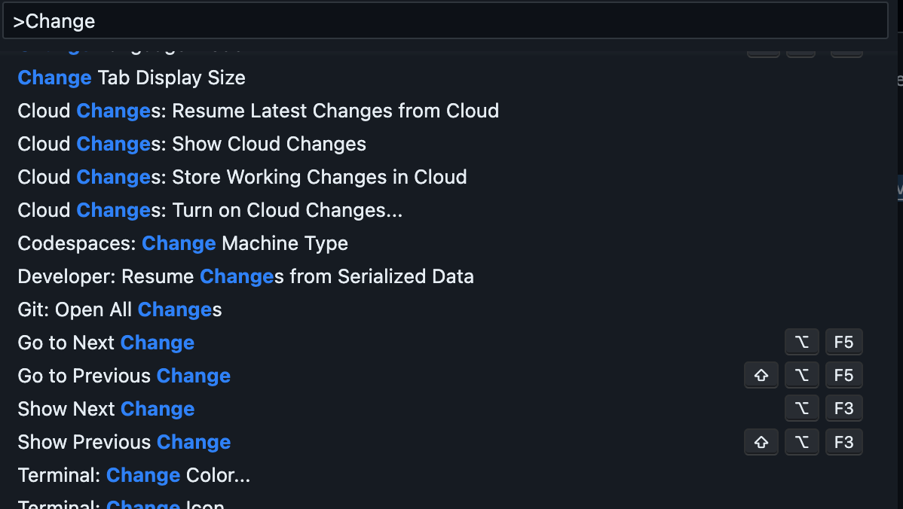


Then Choose '4 cores,8 GB RAM, 32 GB Storage'
   
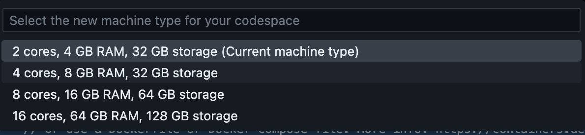

Then restart your machine 
   
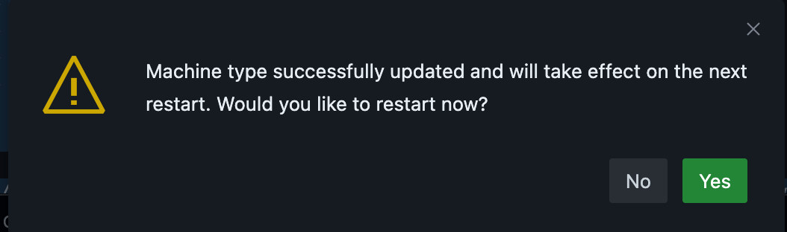

## **🔁 Continue**

Congratulations 🎊🎊🎊! You have completed the construction of the most basic environment, and then go to Lab 1


## **🪵 Resources**

Know more about [GitHub Codespaces](https://docs.github.com/en/codespaces/overview)


