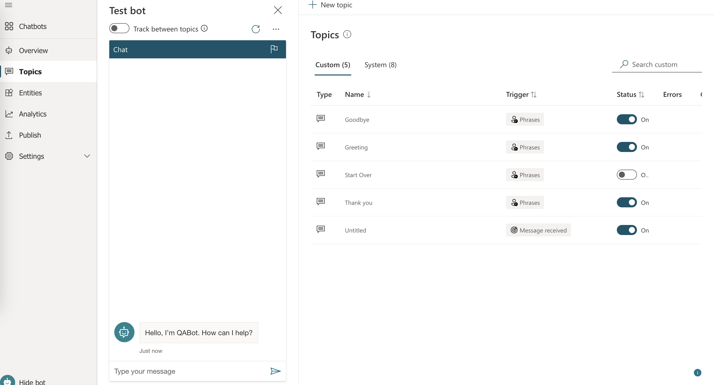
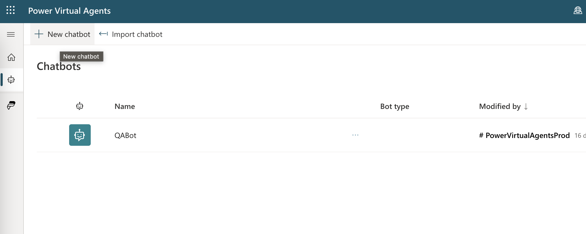
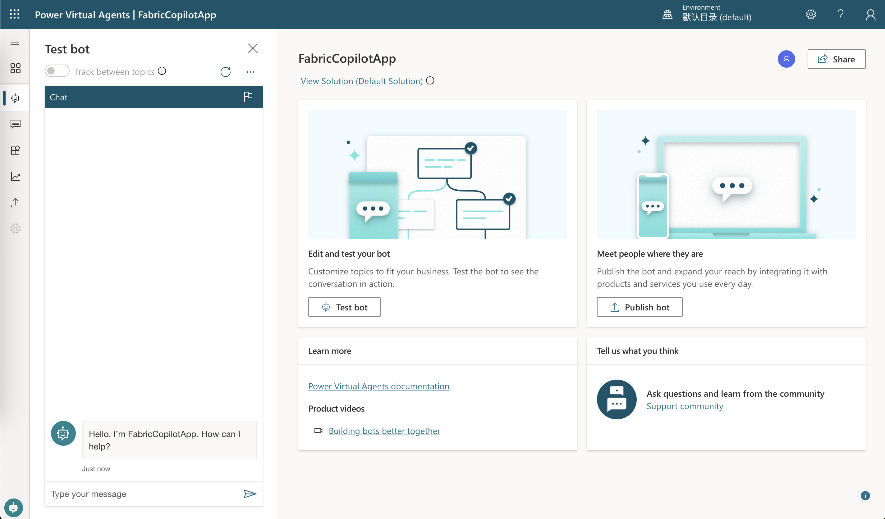
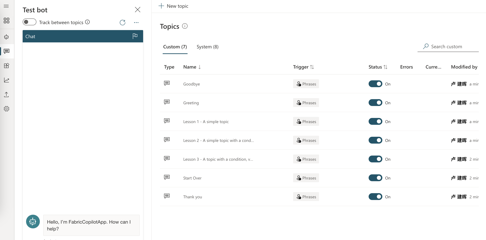
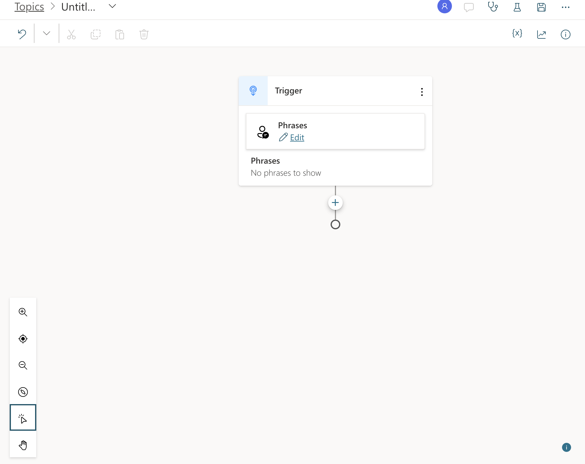
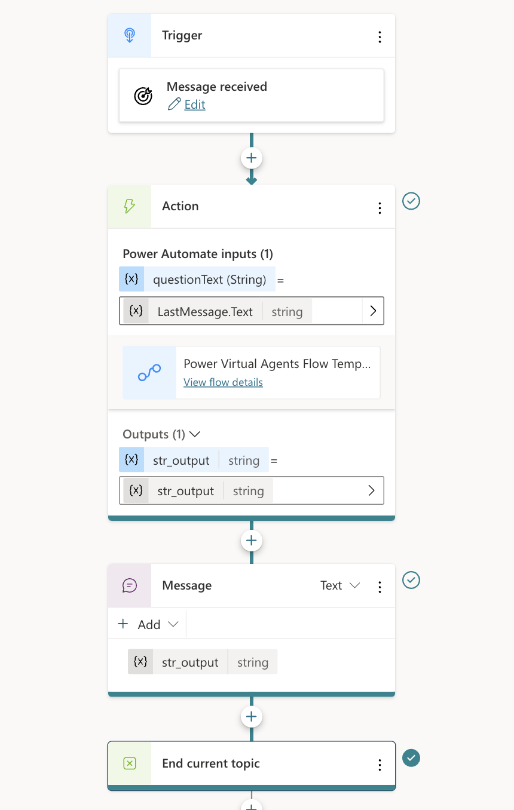
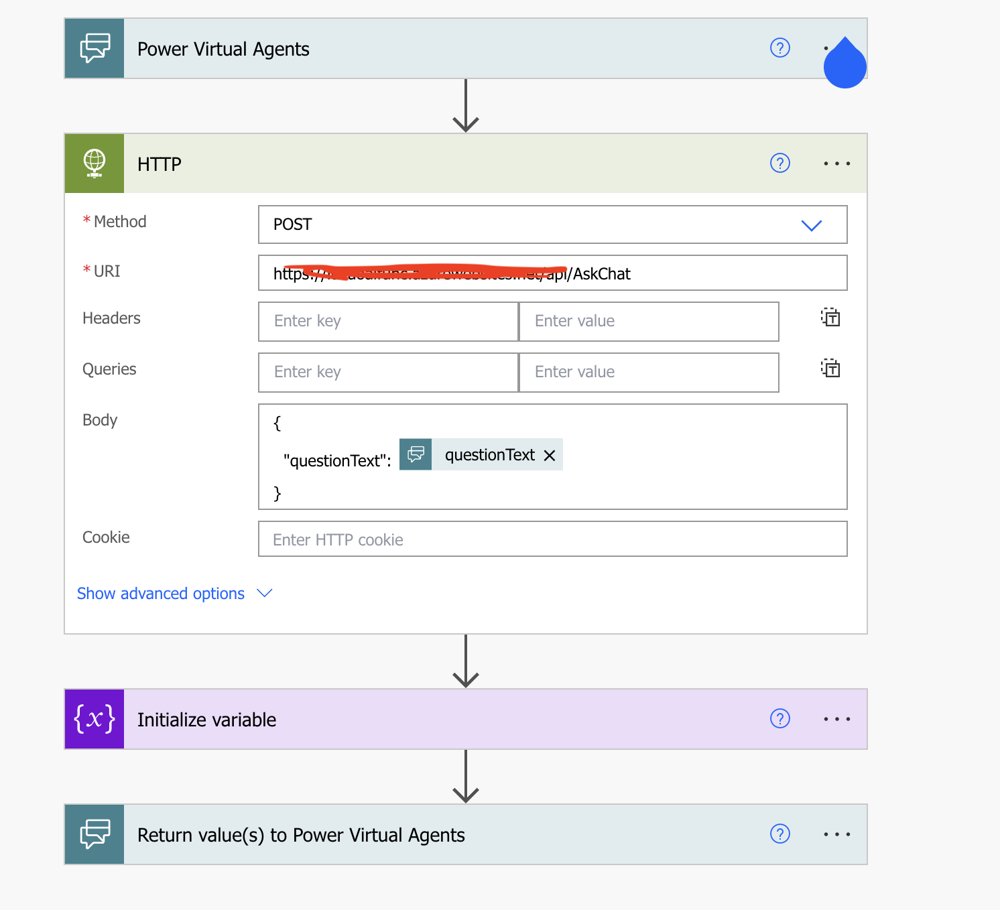
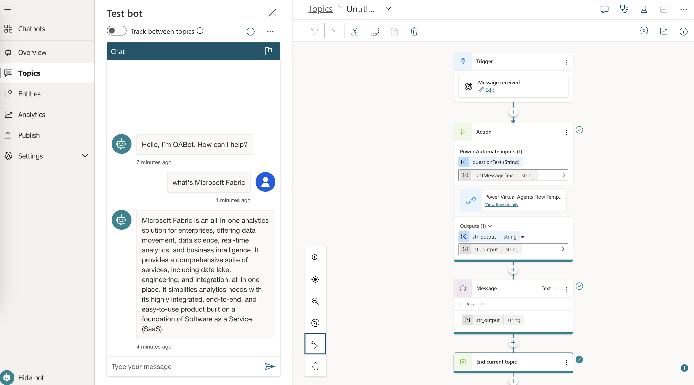
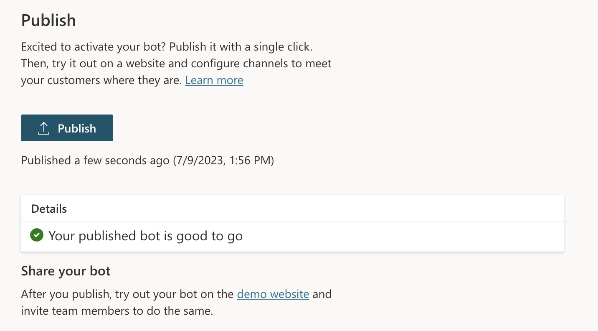
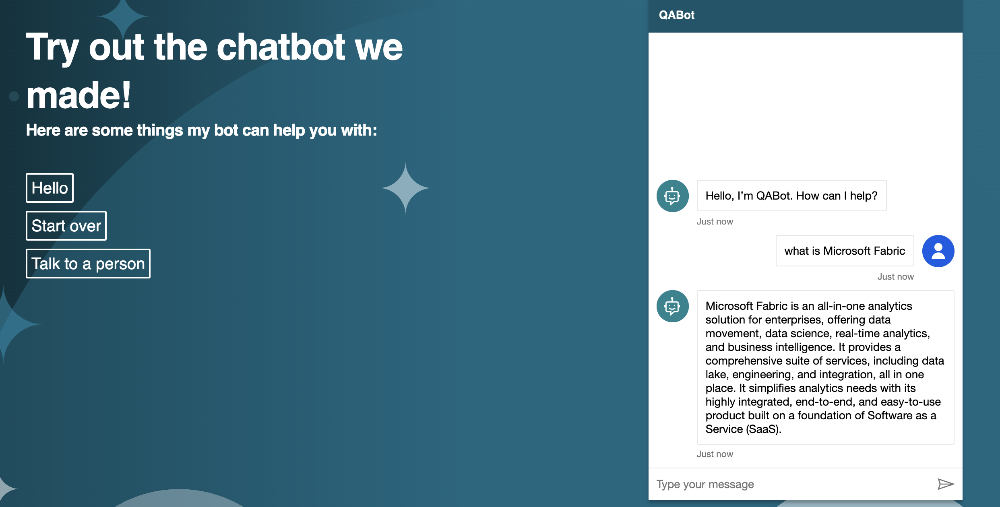

# **🧪 Lab 3 - Create Chatbot with Power Virtual Agent**

We completed the construction of the backend in Lab 2, and Lab 3 is our front-end , which is the interactive work of the front-end Chatbot.

## **Power Virtual Agent**

Power Virtual Agents lets you create powerful AI-powered chatbots for a range of requests—from providing simple answers to common questions to resolving issues requiring complex conversations. Engage with customers and employees in multiple languages across websites, mobile apps, Facebook, Microsoft Teams, or any channel supported by the Azure Bot Framework.

***Note*** If you wish to use PVA, please click [Sign Up](https://go.microsoft.com/fwlink/?LinkId=2107702)

## ***🏃‍♂️ Let‘s go***

1. Open your PVA Portal , to create Chatbot

2. Set Name and  language (Choose English)

   Just a moment , you can go to your PVA application 

3. Go to Topics

   create a new Topic , you can see a Chatbot Flow

   you can set the flow like this

***Note*** PVA Flow can not call Azure Function API directly , you need to depend Power Automate

4. All need to save , you can test ChatBot in your PVA portal

5. The Last you need to publish your Copilot App in your PVA Portal

## **😊😊😊 Congrtulations!!**

Yeah Your first copilot apps is done 

## **🔥 Resources**

1. Learn [Power Virtual Agent](https://learn.microsoft.com/en-us/power-virtual-agents/)

